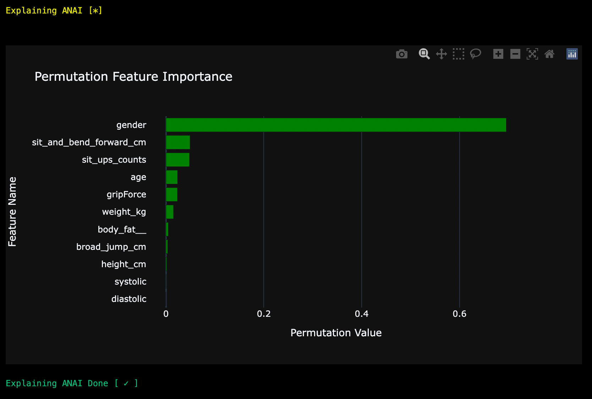
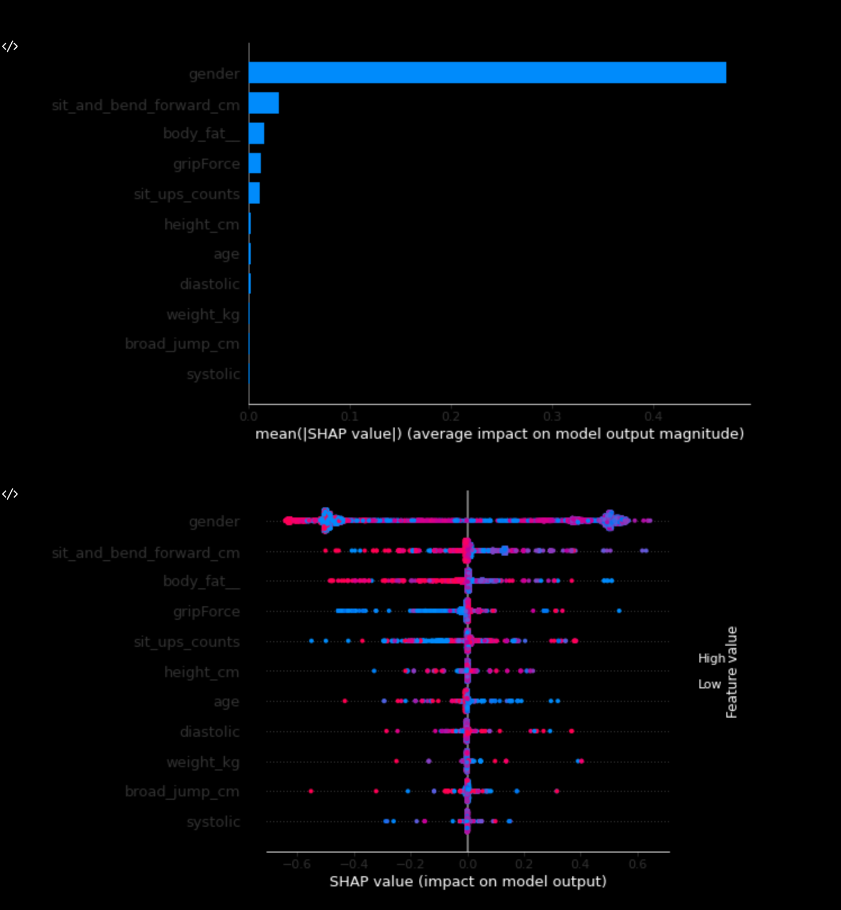
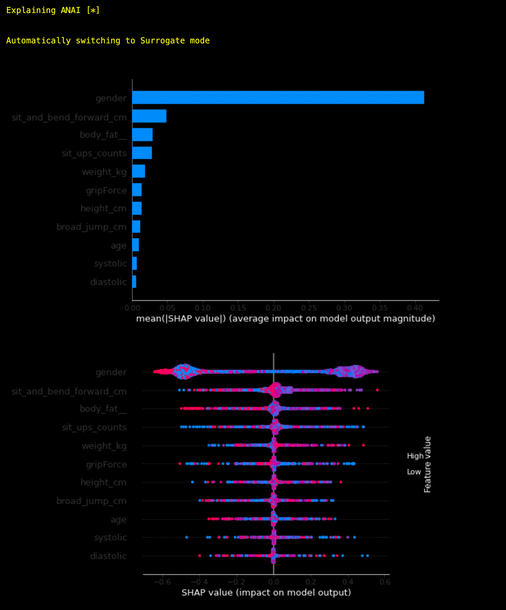
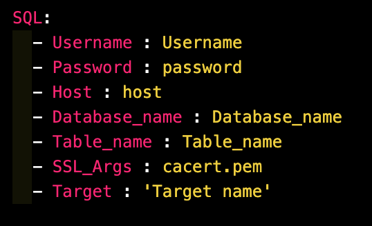
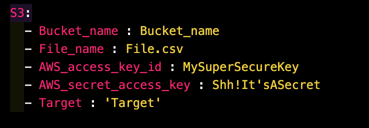
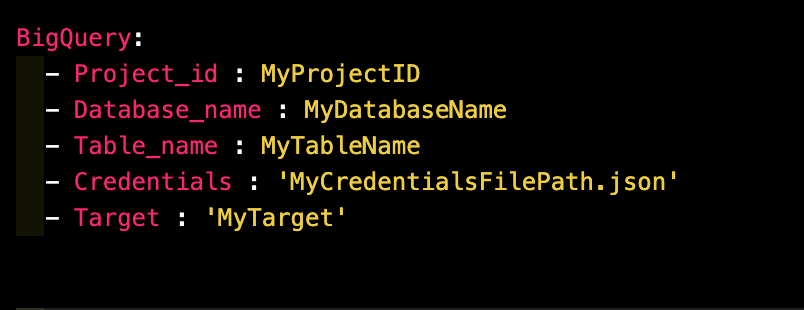

# Features
- [ANAI Preprocessing](Features.md#anai-preprocessing-pipeline)
- [ANAI AutoML](Features.md#automl-pipeline)
- [Explainable ANAI](Features.md#explainable-anai)
- [Algorithms](Features.md#available-algorithms)
- [Anomaly Detection](Features.md#anomaly-detection_1)
- [Ingesting data using inbuilt connectors](Features.md#ingesting-data-using-the-inbuilt-connectors)

## ANAI preprocessing pipeline
### Initialization
    import anai
    from anai.preprocessing import Preprocessor
    df = anai.load("data/bodyPerformance.csv", df_kwargs={"header": None})
    prep = Preprocessor(dataset=df, target="class", except_columns=['weight_kg'])

### Available Preprocessing Methods
#### Data Summary
  Gives a summary of the data.

     summary = prep.summary()

     #Returns a DataFrame

#### Column Statistics
  Gives a column wise statistics of the dataset.

    column_stats = prep.column_summary()

    Returns a DataFrame

#### Imputing Missing Values
  Imputes the missing values using the statistical methods.

    df1 = prep.impute()

    Returns a imputed DataFrame

#### Encoding Categorical Variables
  Encodes the categorical variables.

    df = prep.encode(split = False)

    Returns a encoded DataFrame if split is False else returns a tuple of encoded Features and encoded Labels

#### Scaling Variables
  Scales the variables using StandardScaler.

    df = prep.scale(columns = [<List of Columns>], method = 'standard')

    Available methods are 'standardize' and 'normal'

    Returns a scaled DataFrame

#### Skewness Correction
  Normalizes the skewness of the data.

    df = prep.skewcorrect()

    Returns a BoxCox Normalised DataFrame.

#### Prepare

  Prepares the data for modelling.

    X_train, X_val, y_train, y_val, scaler = prep.prepare(features, labels, test_size, random_state, smote, k_neighbors)

    Arguments:
        - features: pd.DataFrame or np.array
            features to be used for training
        - labels:  pd.Series or np.array
            labels to be used for training
        - test_size: Size of the test set
        - random_state: Random state for splitting the data
        - smote: Boolean to use SMOTE or not
        - k_neighbors: Number of neighbors to use for SMOTE

    Returns:
        - X_train: Training Features
        - X_val: Validation Features
        - y_train: Training Labels
        - y_val: Validation Labels
        - sc:  Scaler Object

## AutoML Pipeline
### Initialization
    import anai
    ai = anai.run(filepath="data/iris.csv", target="class", predictor="lr")

### Arguments
    df : Pandas DataFrame
        DataFrame to be used for modelling.
    filepath : str
        Filepath of the dataframe to be loaded.
    df_kwargs : dict
        Keyword arguments for the dataframe loading function. Only used if filepath is not None.
    target : str
        Target Column Name 
    except_columns : list, optional
        List of Columns to be excluded from the dataset
    predictor : list
                Predicting models to be used
    params : dict
                dictionary containing parameters for model.
                Not available when using predictor = all or multiple predictors.
    test_size: float or int, default=.2
                If float, should be between 0.0 and 1.0 and represent
                the proportion of the dataset to include in
                the test split.
                If int, represents the absolute number of test samples.
    cv_folds : int
            No. of cross validation folds. Default = 10
    pca : bool
        if True will apply PCA on Train and Validation set. Default = False
    lda : str
        if True will apply LDA on Train and Validation set. Default = False
    pca_kernel : str
            Kernel to be use in PCA. Default = 'linear'
    n_components_lda : int
            No. of components for LDA. Default = 1
    n_components_pca : int
            No. of components for PCA. Default = 2
    smote : Bool,
        Whether to apply SMOTE. Default = True
    k_neighbors : int
        No. of neighbors for SMOTE. Default = 1
    verbose : boolean
        Verbosity of models. Default = False
    exclude_models : list
        List of models to be excluded when using predictor = 'all' . Default = []
    path : list
        List containing path to saved model and scaler. Default = None
        Example: [model.pkl, scaler.pkl]
    random_state : int
        Random random_state for reproducibility. Default = 42
    tune : boolean
            when True Applies Optuna to find best parameters for model
            Default is False
    optuna_sampler : Function
        Sampler to be used in optuna. Default = TPESampler()
    optuna_direction : str
        Direction of optimization. Default = 'maximize'
        Available Directions:
            maximize : Maximize
            minimize : Minimize
    optuna_n_trials : int
        No. of trials for optuna. Default = 100
    metric : str,
        metric to be used for model evaluation. Default = 'r2' for regressor and 'accuracy' for classifier
    suppress_task_detection: Bool 
        Whether to suppress automatic task detection. Default = False
    task : str
        Task to be used for model evaluation. Default = None
        Only applicable when suppress_task_detection = True
        Available Tasks:
            classification : Classification
            regression : Regression

### Return
    ai : regression or classification object
        Returns a regression or classification object

### Available Methods
#### Result
 Gives the result of the model.

    result = ai.result()

    Returns a dataframe of the summary
#### Predict
 Predicts the target column for the given data.

    pred = ai.predict(data)

    returns the predictions
#### Save Model
 Saves the model to the given path.

    path_model, path_scaler = ai.save(path = [path_model.pkl, path_scaler.pkl])

    Returns the path to the model and scaler
#### Explain
 Explains the model predictions.

    exp = ai.explain(method = 'shap')

    Avaliable Methods:
        shap : SHAP
        perm : Permutation
### Examples
#### Load Model
 Loads the model from the given path.

    ai = anai.run(path = [path_model.pkl, path_scaler.pkl])

#### Hyperparameter Tuning
 Use Tune=True to apply Optuna to find best parameters for model.

    ai = anai.run(filepath="data/iris.csv", target="class", predictor="lr", tune = True)
#### All Models
 Use predictor = 'all' to use all the models.

    ai = anai.run(filepath="data/iris.csv", target="class", predictor="all")
#### Multiple Models
 Pass a list of models to use to predictor.

    ai = anai.run(filepath="data/iris.csv", target="class", predictor=['lr', 'rf'])
#### Principal Component Analysis
 Use pca = True to use PCA on Train and Validation set.

    ai = anai.run(filepath="data/iris.csv", target="class", predictor="lr", pca = True)
#### Linear Discriminant Analysis
 Use lda = True to use LDA on Train and Validation set.

    ai = anai.run(filepath="data/iris.csv", target="class", predictor="lr", lda = True)

## Explainable ANAI
ANAI model predictions can be explained using SHAP or Permutation.
### Initialize
    import anai
    ai = anai.run(filepath="data/iris.csv", target="class", predictor="lr")

### Explain
    1) Permutation:
       ai.explain(method = 'perm')

     2) SHAP:
        ai.explain(method = 'shap')

### Surrogate Explainer
ANAI uses SHAP tree explainer to explain model predictions. So if the explainer fails to explain certain model it will switch to Surrogate Mode and use Decision Tree Surrogate Model to explain the original trained model. Surrogate mode is available for SHAP and Permutation exaplainers.

      ai = anai.run(filepath="data/iris.csv", target="class", predictor="knn")
      ai.explain(method = 'shap')

As you can see, SHAP explainer failed to explain the model. So it switched to Surrogate Mode and used Decision Tree Surrogate Model to explain the original trained model.

## Available Algorithms

### Regression
    Available Models for Regression

    - "lin": "Linear Regression"
    - "sgd": "Stochastic Gradient Descent Regressor"
    - "krr": "Kernel Ridge Regression"
    - "elas": "Elastic Net Regression"
    - "br": "Bayesian Ridge Regression"
    - "svr": "Support Vector Regressor"
    - "knn": "K-Nearest Neighbors"
    - "dt": "Decision Trees Regressor"
    - "rfr": "Random Forest Regressor"
    - "gbr": "Gradient Boosted Regressor"
    - "ada": "AdaBoostRegressor"
    - "bag": "Bagging Regressor"
    - "ext": "Extra Trees Regressor"
    - "lgbm": "LightGBM Regressor"
    - "xgb": "XGBoost Regressor"
    - "cat": "Catboost Regressor"
    - "ann": "Multi-Layer Perceptron Regressor"
    - "poisson": "Poisson Regressor"
    - "huber": "Huber Regressor"
    - "gamma": "Gamma Regressor"
    - "ridge": "Ridge CV Regressor"
    - "encv": "ElasticNetCV Regressor"
    - "lcv": "LassoCV Regressor"
    - "llic": "LassoLarsIC Regressor"
    - "llcv": "LassoLarsCV Regressor"
    - "ransac": "RANSACRegressor",
    - "ompcv": "OrthogonalMatchingPursuitCV",
    - "gpr": "GaussianProcessRegressor",
    - "omp": "OrthogonalMatchingPursuit",
    - "llars": "LassoLars",
    - "iso": "IsotonicRegression",
    - "rnr": "Radius Neighbors Regressor Regressors",
    - "qr": "Quantile Regression Regressors",
    - "theil": "TheilSenRegressor Regressors",
    - "all": "All Regressors"

### Classification
    
    Available Models for Classification

    - "lr": "Logistic Regression"
    - "sgd": "Stochastic Gradient Descent"
    - "perc": "Perceptron"
    - "pass": "Passive Aggressive Classifier"
    - "ridg": "Ridge Classifier"
    - "svm": "Support Vector Machine"
    - "knn": "K-Nearest Neighbors"
    - "dt": "Decision Trees"
    - "nb": "Naive Bayes"
    - "rfc": "Random Forest Classifier"
    - "gbc": "Gradient Boosting Classifier"
    - "ada": "AdaBoost Classifier"
    - "bag": "Bagging Classifier"
    - "ext": "Extra Trees Classifier"
    - "lgbm": "LightGBM Classifier"
    - "cat": "CatBoost Classifier"
    - "xgb": "XGBoost Classifier"
    - "ann": "Multi Layer Perceptron Classifier"
    - "poisson": "Poisson Classifier"
    - "huber": "Huber Classifiers"
    - "ridge_cv": "RidgeCV Classifier"
    - "encv": "ElasticNet CV Classifier"
    - "lcv": "LassoCV Classifier"
    - "llic": "LassoLarsIC Classifier"
    - "llcv": "LassoLarsCV Classifier"
    - "ransac": "RANSACClassifiers",
    - "ompcv": "OrthogonalMatchingPursuitCV Classifier",
    - "omp": "OrthogonalMatchingPursuit Classifier",
    - "iso": "IsotonicRegression Classifier",
    - "rad": "RadiusNeighbors Classifier",
    - "quantile": "QuantileRegression Classifier",
    - "theil": "TheilSenRegressor Classifier",
    - "lars": "Lars Classifeir",
    - "lcv": "LarsCV Classifier",
    - "tweedie": "TweedieClassifiers",
    - "all": "All Classifiers"

### Model Explanation
     Available Explanation Methods

     - 'perm': Permutation Importance
     - 'shap': Shapley Importance

### Anomaly Detection
ANAI uses PYOD for anomaly detection.

    Available Models for Anomaly Detection 

    - "IForest": "Isolation Forest"
    - "CBLOF": "Cluster-based Local Outlier Factor"

### Missing Data handling
ANAI supports statistical imputing
    
    Available Methods for Missing Data Handling
    - "mean": "Mean Imputation"
    - "median": "Median Imputation"
    - "mode": "Mode Imputation"
    - "drop": "Drop Missing Data"

### Categorical Encoding
ANAI uses catboost encoder for categorical feature encoding and Label Encoding for categorical target

### Scaling
ANAI supports both standard and normalization scaling.
     
     Available Scaling Methods
    - "standardize": "Standard Scaling"
    - "normalize": "Normalization Scaling"

## Anomaly Detection
### Usage
    import anai

    from anai.unsupervised import anomaly_detector

    df = anai.load(filepath='data/iris.csv')

    (anomaly_combined,
    data_with_outliers,
    data_with_Inliers,
    anomaly_summary) = anomaly_detector(dataset = df, target = 'class', model = ['IForest', 'CBLOF'])

### Returns
    anomaly_combined : DataFrame
    df modified with anomaly scores and anomaly
    data_with_outliers : DataFrame
    Only outliers
    data_with_Inliers : DataFrame
    Only Inliers
    anomaly_summary : DataFrame
    Summary of the anomaly detection

## Ingesting data using the inbuilt connectors

### Supported Sources

     1) MySQL
     2) S3
     3) BigQuery

### Examples

#### Example Config File for MySQL

#### Example Config File for S3

#### Example Config File for BigQuery

### Run ANAI
ANAI will automatically detect the source of the data and run the appropriate connector using the config file. When Config = True. ANAI will automatically find the anai_config.yaml file in the current working directory.

    import anai
    ai = anai.run(config=True, predictor=['rfr'])